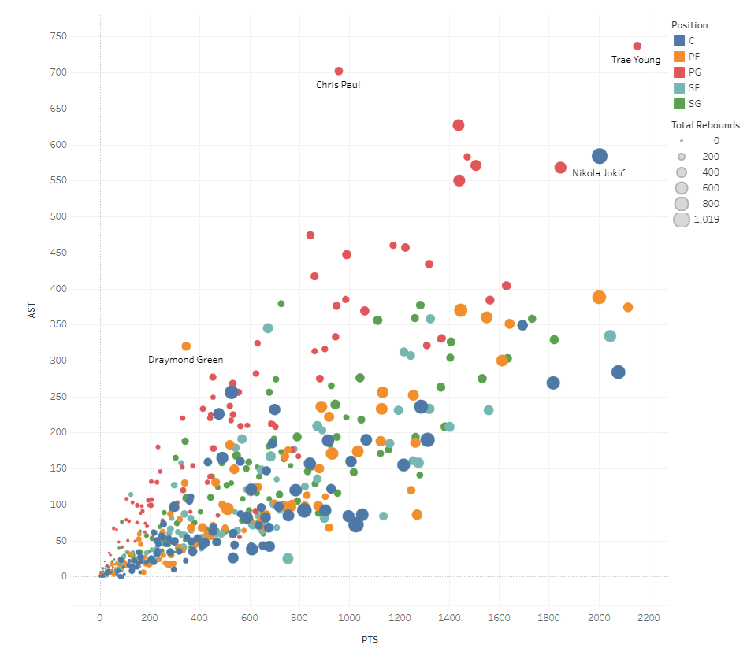
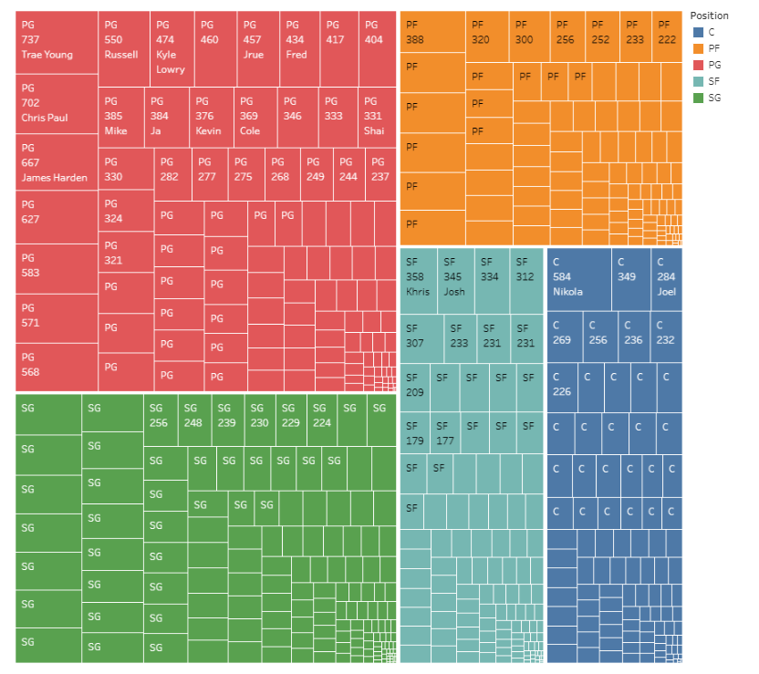
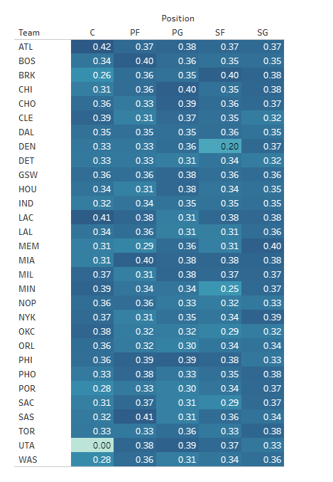
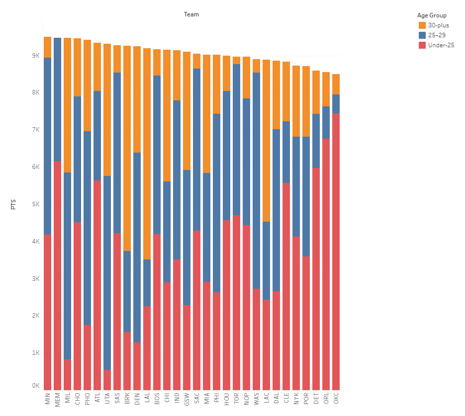
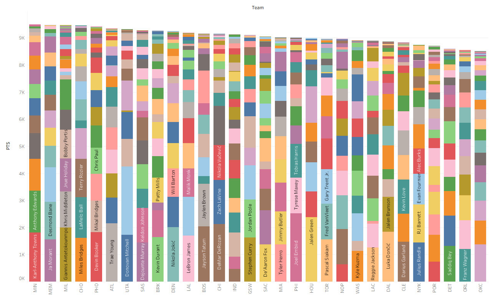

# NBA Player Performance — Tableau Analysis

## Executive Summary

This project analyzes NBA player statistics across points, assists, and rebounds for 500+ players spanning all 30 teams, built into an interactive Tableau dashboard to examine what "well-rounded" actually looks like at the player and team level.

Three material findings emerged:

- Nikola Jokić stands alone as the only player combining elite scoring, top-tier playmaking, and dominant rebounding — no other player comes close to that three-dimensional combination.
- Point guards account for the overwhelming majority of league assists, making Jokić's assist numbers at center even more statistically anomalous by position.
- Teams built around younger rosters outscored veteran-heavy teams in total points, challenging the assumption that experience drives offensive output.

## Business Questions

- Which players combine scoring, playmaking, and rebounding at the highest level — and what separates a specialist from a truly well-rounded player?
- How does assist production distribute across positions, and how does Jokić's playmaking compare to guards?
- How does 3-point shooting vary by team and position, and where are teams choosing to deploy or avoid the three-ball?
- Does roster age correlate with scoring output, and what explains the variation?
- How evenly is scoring distributed within each team roster — and which franchises are star-driven vs. depth-driven?

## Data Sources

| Dataset | Description |
|---|---|
| NBA Player Stats | Points, assists, and rebounds for 500+ players across all 30 teams |
| Position Data | Player position classification (PG, SG, SF, PF, C) |
| Team Metadata | Team name, roster age groupings, and shooting data |
| Coverage | 2021–22 NBA regular season |
| Source | Public NBA statistics |

## Tools & Skills Used

- **Tableau**: Interactive multi-chart dashboard, bubble charts, treemaps, heat maps, stacked bar charts
- **Data visualization**: Multi-view layout with position- and team-level filtering
- **Exploratory analysis**: Identifying outliers, comparing distributions across positions and age groups
- **Calculated fields**: Aggregating stats by team, position, and age group in Tableau

## Key Findings

### The Bubble Chart: Jokić as the True Outlier



The bubble chart plots Points (x-axis), Assists (y-axis), and Rebounds (bubble size). Trae Young sits furthest into the top-right quadrant — elite scoring and the highest assist total in the league. But the player who actually stands out is Nikola Jokić. His bubble dwarfs everyone else on the chart. No other player comes close to combining scoring, playmaking, and rebounding at his level. Trae Young is a specialist. Jokić does everything. Chris Paul sits high on assists with moderate scoring. Draymond Green shows high assists and minimal scoring — a reminder that "value" doesn't always show up in points.

### Guards Dominate Assists — Which Makes Jokić More Remarkable



The assists treemap breaks down total assists by player and position. Point guards — Trae Young, Chris Paul, James Harden — take up the majority of the visual space. Outside of guards, assist numbers drop sharply. Small forwards and centers represent a fraction of total playmaking. This position-to-playmaking relationship makes Jokić's assist production structurally more anomalous than the raw numbers alone suggest.

### 3-Point Shooting: Wide Variance by Team and Position



The heat map breaks down 3-point percentage by team and position. Most values cluster between 0.33 and 0.40, but the outliers reveal where teams are making deployment decisions rather than just identifying poor shooters. Utah's center slot reads 0.00 — either no attempts or too few to register. Denver's small forward sits at 0.20. The LAC center leads at 0.41. The chart surfaces roster construction strategy as much as individual shooting performance.

### Younger Rosters Score More — But Age May Not Be the Driver



The stacked bar by age group contradicts the intuition that veteran teams outperform. Teams built around younger players led in total points scored, with the top two teams showing minimal contribution from players 30 and older. The nuance: team construction philosophy, pace of play, and salary cap strategy all shape these numbers. Age may be a proxy for roster design decisions rather than an independent performance driver.

### Scoring Distribution Reveals Star-Driven vs. Depth-Driven Rosters



The stacked bar by player shows how unevenly scoring is distributed within each franchise. Minnesota's bar is topped by Karl-Anthony Towns. Milwaukee leans heavily on Giannis Antetokounmpo. Both are star-driven structures — one player carries the offensive load. Other rosters distribute scoring across eight or nine contributors. The construction gap between star-driven and depth-driven teams is a meaningful strategic distinction worth tracking over multiple seasons.

## Key Recommendations

- **Track multi-season trends**: A single season identifies where performance stands; multi-year data identifies which players are becoming more well-rounded and which teams are evolving their roster strategy. The real analytical value is directional, not static.
- **Control for pace of play in scoring comparisons**: Total points by age group will reflect pace as much as quality. Per-possession or per-36-minute normalization would separate true performance from volume effects.
- **Investigate the Jokić model as a roster construction signal**: His combination of skills at center challenges positional conventions. Teams building around versatile bigs who can facilitate should be modeled differently than traditional center-forward structures.
- **Use 3-point deployment data to evaluate offensive system fit**: The heat map reveals where teams are choosing not to shoot from deep by position — surfacing potential inefficiencies or intentional system design decisions worth probing further.

## Data Cleaning, Assumptions & Limitations

- Analysis reflects a single NBA regular season; year-over-year trends are not available in this dataset.
- Bubble chart comparisons are based on raw counting stats and do not control for pace, minutes played, or usage rate.
- Age group classifications use player age at the time of the season; roster composition changes mid-season are not reflected.
- 3-point percentage figures for players with very low attempt counts may not be statistically meaningful and should be interpreted directionally.
- Analysis does not account for injury-shortened seasons, which may understate certain players' full-season contributions.

## Project Structure

```
nba-player-performance-analysis/
├── dashboard_preview.png      # Dashboard overview screenshot
├── bubble_chart.png           # Points vs. assists vs. rebounds bubble chart
├── assists_treemap.png        # Assists by player and position treemap
├── threept_heatmap.png        # 3-point percentage heat map by team and position
├── scoring_by_age.png         # Stacked bar: scoring by age group
├── scoring_by_player.png      # Stacked bar: scoring distribution by player
└── README.md
```

## Interactive Dashboard

[View on Tableau Public](https://public.tableau.com/app/profile/aristotle.polites/viz/NBAProject_17811792140710/AnalysisUpdate062026)
